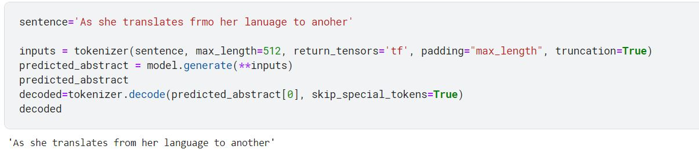
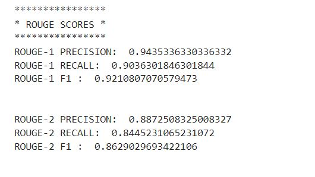
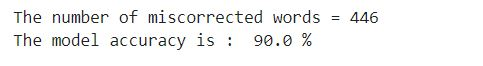
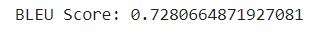

# Sentence Spelling Correction

In this code, we fine-tuned BART for conditional generation to correct sentences. We used the [WikiSplit dataset](https://github.com/google-research-datasets/wiki-split) for training. Additionally, we implemented functions to manipulate the dataset by inserting random characters, removing random characters, and replacing random characters to simulate errors. We evaluated the model using ROUGE, BLEU, and word accuracy metrics.

